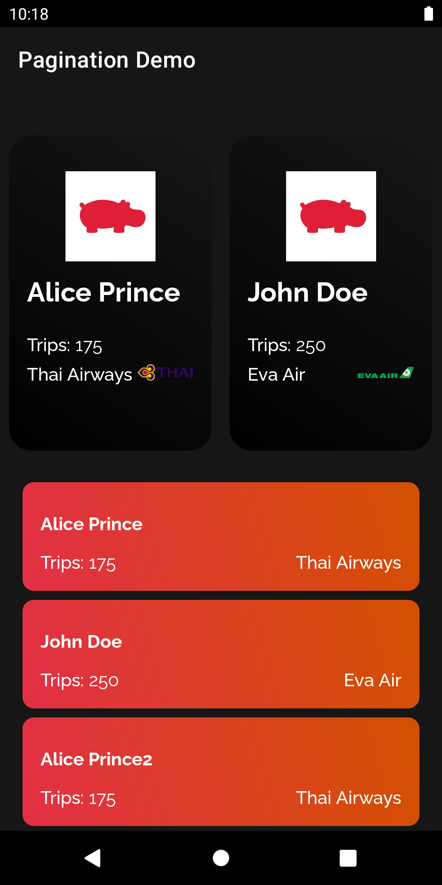

# Implementing Pagination in Android
> This is a sample android app to show how to implement pagination to an android app.

This project aims to teach how to implement pagination to an android app. There are various solutions for pagination, and one of them is to use Paging 3 Library. It is easy to implement, and compatible with various devices. Also, this example demonstrates how to implement pagination for fetching data from an API that supports pagination. It is also possible to implement pagination to other data sources, but it is not the focus of this demo.

## About the application
This is a demo app to show passengers on a flight. They are displayed in two different recyclerviews (one vertical, and one horizontal). The data is fetched from a [passenger API][api] which supports pagination. The endpoint requires page and page size as parameters that are easily calculated and provided to the endpoint with the help of the paging library.

## Screenshots

  

## Documentation
1 - Paging 3: The Paging Library helps you load and display pages of data from a larger dataset from local storage or over network. This approach allows your app to use both network bandwidth and system resources more efficiently. Link -> [Paging 3.0][paging]

2- Fake Rest API: This API is used to fetch the data of passengers. It is a fake data provider API that supports pagination. -> Link [Passenger API][api]

## Tutorial Video
There is also a very short tutorial video for this project in which implementation is explained.
So in case of any kind of need to understand the project, just go and check out the video and leave a comment if you still have something unclear in your mind.
Link -> [Youtube video][youtube]

<!-- Markdown link & img dfn's -->
[paging]: https://developer.android.com/topic/libraries/architecture/paging/v3-overview
[api]: https://www.instantwebtools.net/fake-rest-api
[youtube]: https://www.youtube.com
